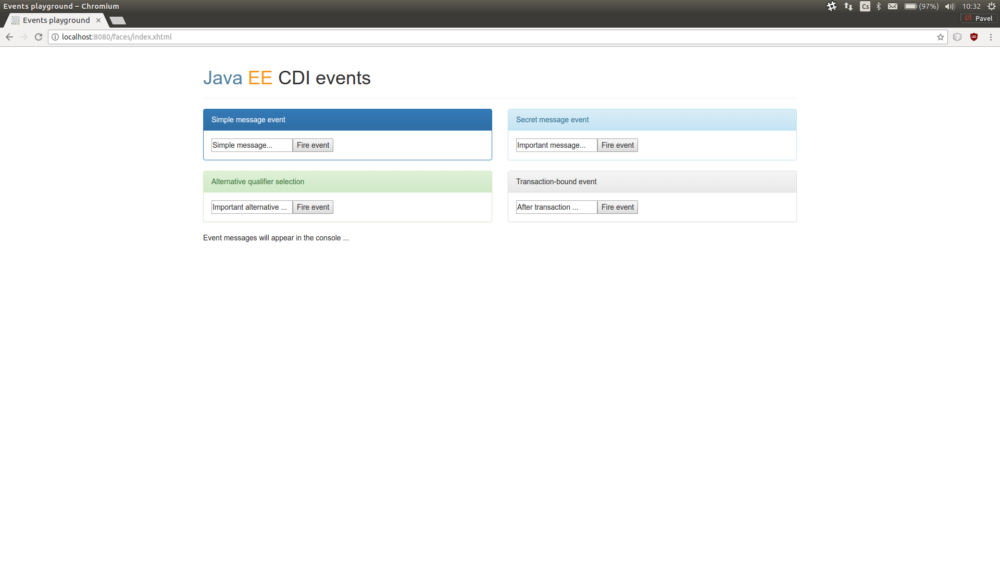

# CDI Events Playground
Sample project for [CDI Events overview](http://www.pavel.cool/javaee/cdi-events/) article.

## Running it

1. Git clone the repository
1. Run *Maven goal* `wildfly-swarm:run`
1. Visit http://localhost:8080/ in your browser

**Done !** WildFly Swarm will scan the project and automatically download all the parts necessary to run the application. No interaction required. The download phase only occurs during the first run. During the process, an in-memory H2 database is started.

### Logging note
The result of the events fired is visible in console. Standard output is used directly instead of a logger.
